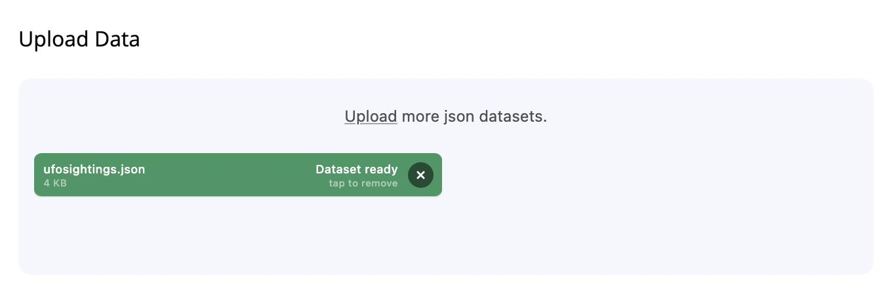
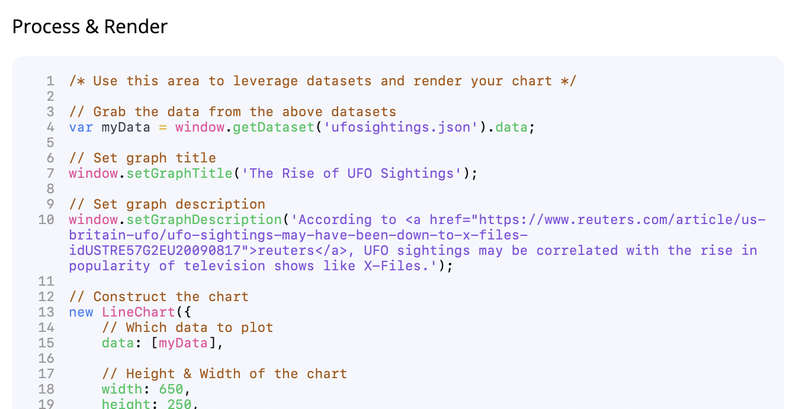
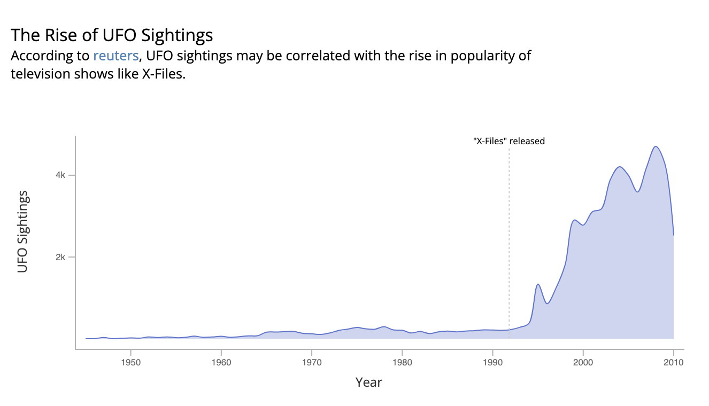

# Visualize
Find it hard to visualize the perfect graph for your data?

[Visualize](https://rishabhsingh8.github.io/visualize) is for you.

## Instructions
1. Visit [Visualize](https://rishabhsingh8.github.io/visualize)
2. Upload your json datasets
    
3. Use `javascript` to process your data & render a chart using the [metricsgraphics](https://metricsgraphicsjs.org/) library
    
4. Tada
    